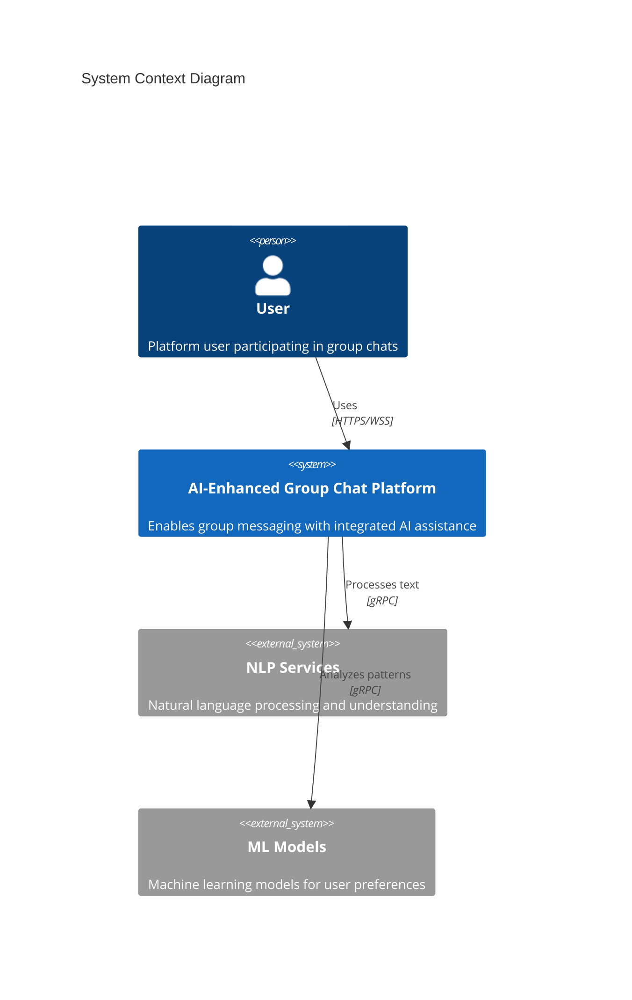

# AI-Enhanced Group Chat Platform

[](https://github.com/{org}/{repo}/actions)
[](https://codecov.io/gh/{org}/{repo})
[](LICENSE)
[](https://github.com/{org}/{repo}/releases)

## Overview

The AI-Enhanced Group Chat Platform is a next-generation messaging solution that seamlessly integrates specialized artificial intelligence agents into group conversations. The platform enables efficient group communication, decision-making, and knowledge sharing through contextual AI assistance.

### Key Features

- Real-time group messaging with AI agent integration
- Context-aware natural language processing
- Specialized AI agents for different domains (travel, dining, planning, etc.)
- Group decision support tools (polls, recommendations)
- User preference learning and personalization
- Enterprise-grade security and scalability

### Architecture



### Technology Stack

- **Backend**: Node.js 18 LTS, Python 3.11+
- **Frontend**: React 18.2+, TypeScript 5.0+
- **Mobile**: React Native 0.72+
- **Database**: MongoDB 6.0+, PostgreSQL 14+
- **Cache**: Redis 7.0+
- **AI/ML**: FastAPI, LangChain
- **Infrastructure**: AWS, Kubernetes

## Quick Start

### Prerequisites

```bash
# Install Node.js 18 LTS
nvm install 18
nvm use 18

# Install Python 3.11+
pyenv install 3.11
pyenv global 3.11

# Install pnpm
npm install -g pnpm

# Install Docker
# Follow instructions at https://docs.docker.com/get-docker/
```

### Environment Setup

```bash
# Clone repository
git clone https://github.com/{org}/{repo}.git
cd {repo}

# Install dependencies
pnpm install

# Configure environment
cp .env.example .env
# Edit .env with your configuration

# Start development environment
pnpm dev
```

### Basic Usage

```bash
# Start all services
pnpm start

# Run tests
pnpm test

# Build for production
pnpm build
```

## Project Structure

```
.
├── src/
│   ├── backend/        # Backend services
│   ├── web/           # Web application
│   ├── mobile/        # Mobile application
│   └── test/          # Test suites
├── infrastructure/    # Infrastructure configuration
├── docs/             # Documentation
├── scripts/          # Utility scripts
└── config/           # Configuration files
```

### Key Components

- `backend/`: Microservices implementation
- `web/`: React web application
- `mobile/`: React Native mobile apps
- `infrastructure/`: Kubernetes and AWS configurations
- `test/`: Integration and E2E tests

### Configuration

Required environment variables:

```
NODE_ENV=development
API_PORT=3000
DATABASE_URL=mongodb://localhost:27017
REDIS_URL=redis://localhost:6379
AI_SERVICE_KEY=your_openai_key
```

## Development

### Code Style

- Follow [TypeScript Style Guide](docs/style-guide.md)
- Use ESLint and Prettier configurations
- Write unit tests for all new features
- Document API changes in OpenAPI specification

### Testing

```bash
# Run unit tests
pnpm test:unit

# Run integration tests
pnpm test:integration

# Run E2E tests
pnpm test:e2e

# Generate coverage report
pnpm test:coverage
```

### Debugging

- Use VS Code launch configurations in `.vscode/`
- Chrome DevTools for frontend debugging
- Debug logs with `DEBUG=app:*` environment variable

## Deployment

### Production Setup

1. Configure AWS credentials
2. Update infrastructure configuration
3. Deploy using CI/CD pipeline

```bash
# Deploy to staging
pnpm deploy:staging

# Deploy to production
pnpm deploy:prod
```

### Monitoring

- Datadog for metrics and logging
- Grafana dashboards for visualization
- Prometheus for metrics collection
- ELK stack for log aggregation

## Security

### Authentication

- OAuth 2.0 / OpenID Connect
- JWT for session management
- MFA support for sensitive operations

### Data Protection

- TLS 1.3 for data in transit
- AES-256 encryption for data at rest
- Regular security audits
- GDPR compliance measures

## Contributing

### Development Workflow

1. Fork the repository
2. Create a feature branch
3. Implement changes with tests
4. Submit pull request
5. Await code review

### Pull Request Guidelines

- Follow the PR template
- Include test coverage
- Update documentation
- Add changelog entry

## Support

### Troubleshooting

Common issues and solutions are documented in the [Wiki](docs/wiki).

### FAQ

See [Frequently Asked Questions](docs/faq.md)

### Getting Help

- GitHub Issues for bug reports
- Discussions for feature requests
- Stack Overflow for technical questions
- Email support for security issues

## License

This project is licensed under the MIT License - see the [LICENSE](LICENSE) file for details.