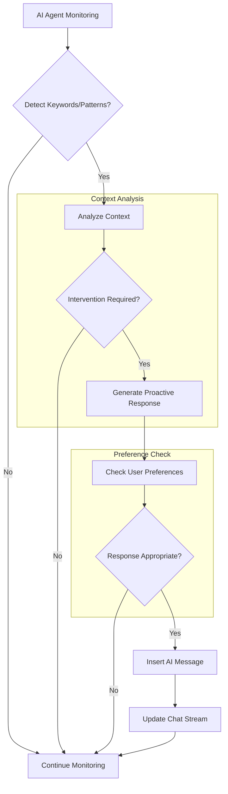
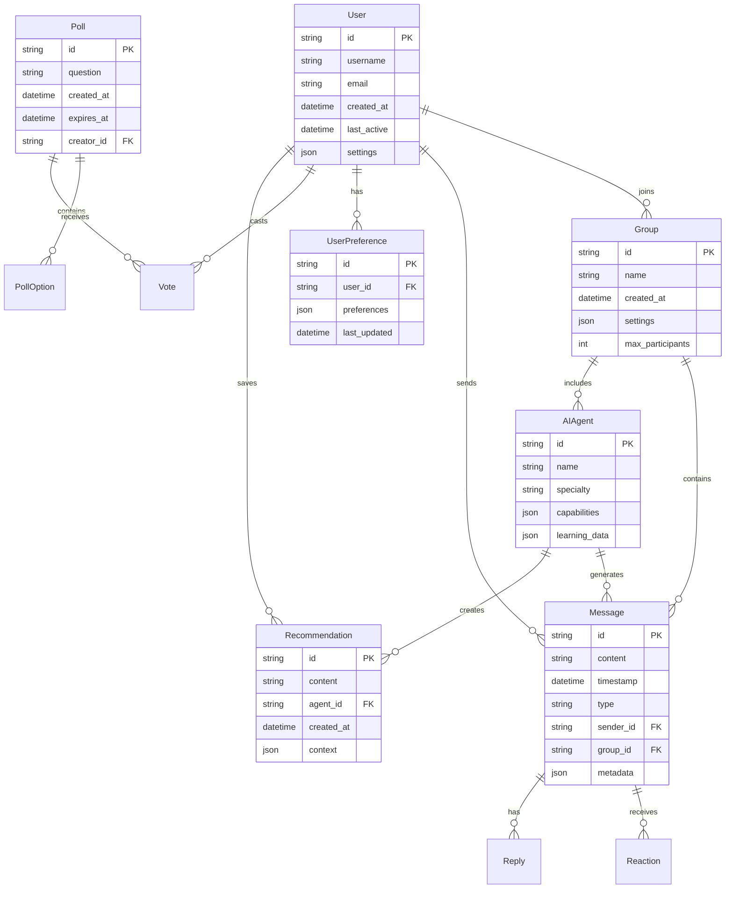
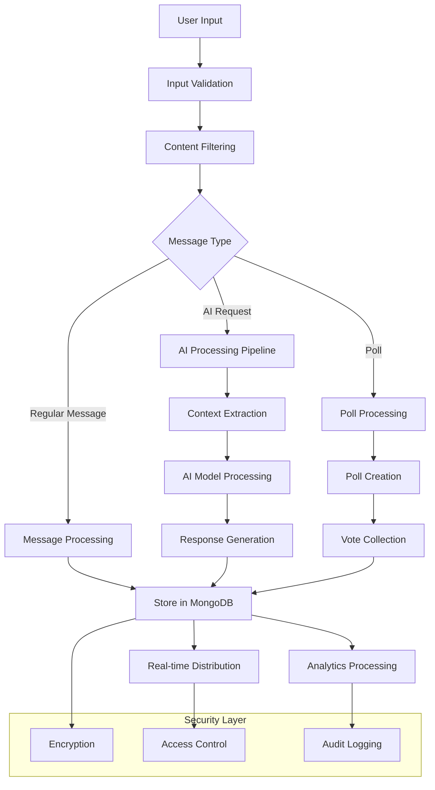
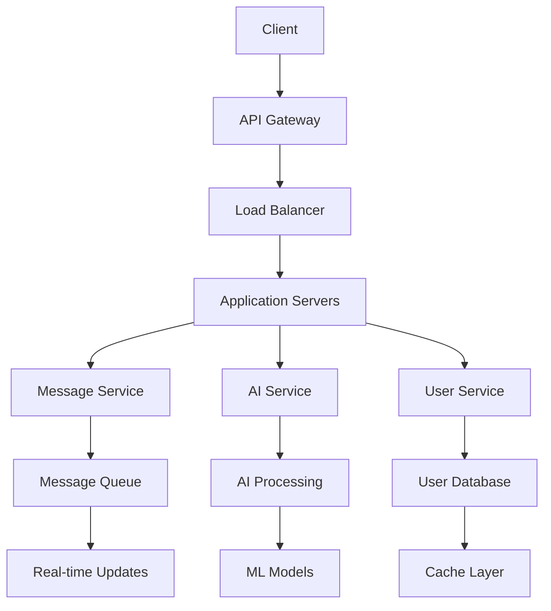

# Product Requirements Document (PRD)

# 1. INTRODUCTION

## 1.1 Purpose
This Software Requirements Specification (SRS) document provides a comprehensive description of the AI-Enhanced Group Chat Platform. It details the functional and non-functional requirements for developers, project managers, QA teams, and stakeholders involved in the development process. The document serves as the primary reference for technical and functional requirements during the design, implementation, and testing phases.

## 1.2 Scope
The AI-Enhanced Group Chat Platform is a messaging application that integrates artificial intelligence agents into group conversations. The system aims to enhance group communication and decision-making by providing specialized AI assistance within chat environments.

Key features and functionalities include:

- Real-time group chat messaging system
- Integration of specialized AI agents with distinct expertise domains
- Context-aware AI interactions through @ mentions
- Proactive AI assistance based on conversation monitoring
- Customizable AI agent profiles and specialties
- Group polling and decision-making tools
- Recommendation storage and sharing capabilities
- Conversation history and context retention
- Multi-user preference learning and adaptation

The platform will benefit users by:
- Streamlining group planning and decision-making processes
- Providing instant access to specialized knowledge and recommendations
- Maintaining natural conversation flow while incorporating AI assistance
- Facilitating better group coordination and consensus building
- Offering personalized suggestions based on group dynamics

Out of scope items:
- Video or voice calling features
- File storage system
- End-to-end encryption
- Payment processing capabilities
- Third-party app integrations

# 2. PRODUCT DESCRIPTION

## 2.1 Product Perspective
The AI-Enhanced Group Chat Platform operates as a standalone messaging application while integrating with external AI services and databases. The system architecture consists of:

- Frontend client applications (web and mobile)
- Backend messaging infrastructure
- AI processing engine
- User preference database
- Context management system
- Real-time notification service

The platform interfaces with:
- Natural Language Processing (NLP) services
- Machine Learning models for preference analysis
- External knowledge bases for AI agent expertise
- Cloud hosting infrastructure
- Authentication services

## 2.2 Product Functions
The primary functions include:

1. Group Chat Management
   - Create and manage group conversations
   - Real-time message delivery and synchronization
   - Message threading and organization
   - User presence indicators

2. AI Agent Integration
   - Dynamic AI agent allocation to chat groups
   - Context-aware agent responses
   - Proactive monitoring and suggestions
   - Agent specialization and expertise management

3. User Interaction
   - @mention functionality for AI agents
   - Poll creation and voting
   - Recommendation storage and retrieval
   - Preference settings management

4. Learning and Adaptation
   - Group preference analysis
   - Conversation context retention
   - Historical interaction learning
   - Personalization algorithms

## 2.3 User Characteristics

### Primary Users
- Age Range: 18-45
- Technical Proficiency: Basic to intermediate
- Device Usage: Primarily mobile, secondary desktop
- Usage Frequency: Daily to weekly

### User Personas

1. Social Organizer
   - Frequently plans group activities
   - Coordinates multiple participants
   - Values efficiency in decision-making

2. Casual Participant
   - Joins group discussions
   - Contributes to collective decisions
   - Moderate engagement level

3. Technology Enthusiast
   - Explores advanced features
   - Tests AI agent capabilities
   - High engagement with platform features

## 2.4 Constraints

1. Technical Constraints
   - Maximum group size limit of 50 participants
   - Message history retention period of 12 months
   - API rate limits for AI agent interactions
   - Mobile device compatibility requirements

2. Operational Constraints
   - Internet connectivity requirement
   - Server response time limitations
   - Data storage capacity restrictions
   - Processing power limitations for AI operations

3. Security Constraints
   - User data protection requirements
   - Privacy compliance regulations
   - Authentication protocol limitations
   - Data encryption standards

## 2.5 Assumptions and Dependencies

### Assumptions
1. Users have consistent internet access
2. Basic familiarity with chat applications
3. English language primary interface
4. Mobile device availability
5. User willingness to interact with AI agents

### Dependencies
1. External Services
   - Cloud infrastructure availability
   - AI processing service uptime
   - Third-party authentication services
   - Data storage systems

2. Technical Requirements
   - Modern web browser support
   - Mobile OS compatibility
   - Server processing capacity
   - Network bandwidth availability

3. Development Resources
   - AI model training data
   - Development team expertise
   - Testing environment availability
   - Documentation systems

# 3. PROCESS FLOWCHART

```mermaid
flowchart TD
    A[User Opens App] --> B[Authentication]
    B --> C{New or Existing Chat?}
    
    C -->|New| D[Create Group Chat]
    C -->|Existing| E[Load Chat History]
    
    D --> F[Add Participants]
    F --> G[Select AI Agents]
    G --> H[Initialize Chat]
    
    E --> H
    
    H --> I[Chat Active State]
    
    I --> J{User Action?}
    
    J -->|Send Message| K[Process Regular Message]
    J -->|@mention AI| L[Trigger AI Agent]
    J -->|Create Poll| M[Initialize Poll]
    
    K --> N[Update Chat Stream]
    
    L --> O[Process Context]
    O --> P[Generate AI Response]
    P --> N
    
    M --> Q[Collect Votes]
    Q --> R[Display Results]
    R --> N
    
    N --> S{Continue Chat?}
    S -->|Yes| I
    S -->|No| T[End Session]
    
    subgraph AI Processing
    O
    P
    end
    
    subgraph Poll System
    M
    Q
    R
    end
```



# 4. FUNCTIONAL REQUIREMENTS

## 4.1 Core Messaging System

### ID: F-MSG-001
### Description
Real-time messaging system enabling group conversations with support for text, emojis, and basic formatting.
### Priority: High
### Requirements

| ID | Requirement | Priority |
|---|---|---|
| F-MSG-101 | Support real-time message delivery with <2 second latency | High |
| F-MSG-102 | Enable message threading and replies | High |
| F-MSG-103 | Provide typing indicators and read receipts | Medium |
| F-MSG-104 | Support basic text formatting (bold, italic, lists) | Medium |
| F-MSG-105 | Allow emoji reactions to messages | Low |

## 4.2 AI Agent Integration

### ID: F-AI-001
### Description
Integration of specialized AI agents into group chats with distinct expertise domains and interaction capabilities.
### Priority: High
### Requirements

| ID | Requirement | Priority |
|---|---|---|
| F-AI-101 | Support @mention triggering of AI agents | High |
| F-AI-102 | Enable context-aware AI responses | High |
| F-AI-103 | Implement proactive monitoring and suggestions | Medium |
| F-AI-104 | Support multiple concurrent AI agents per chat | Medium |
| F-AI-105 | Allow customization of AI agent specialties | Low |

## 4.3 Group Decision Tools

### ID: F-DEC-001
### Description
Tools and features supporting group decision-making and consensus building.
### Priority: Medium
### Requirements

| ID | Requirement | Priority |
|---|---|---|
| F-DEC-101 | Create and manage polls with multiple options | High |
| F-DEC-102 | Track and display voting results in real-time | High |
| F-DEC-103 | Allow poll deadline setting | Medium |
| F-DEC-104 | Support poll result visualization | Medium |
| F-DEC-105 | Enable poll result sharing and saving | Low |

## 4.4 Preference Learning System

### ID: F-PRF-001
### Description
System for learning and adapting to user and group preferences over time.
### Priority: Medium
### Requirements

| ID | Requirement | Priority |
|---|---|---|
| F-PRF-101 | Track individual user preferences | High |
| F-PRF-102 | Analyze group interaction patterns | High |
| F-PRF-103 | Store and retrieve conversation context | Medium |
| F-PRF-104 | Generate personalized recommendations | Medium |
| F-PRF-105 | Support preference export and reset | Low |

## 4.5 Recommendation Management

### ID: F-REC-001
### Description
System for storing, organizing, and sharing AI agent recommendations.
### Priority: Low
### Requirements

| ID | Requirement | Priority |
|---|---|---|
| F-REC-101 | Save AI recommendations to user profile | High |
| F-REC-102 | Share recommendations within groups | High |
| F-REC-103 | Categorize and tag recommendations | Medium |
| F-REC-104 | Search saved recommendations | Medium |
| F-REC-105 | Export recommendations to external formats | Low |

# 5. NON-FUNCTIONAL REQUIREMENTS

## 5.1 Performance Requirements

| ID | Requirement | Target Metric |
|---|---|---|
| NF-PRF-001 | Message delivery latency | < 2 seconds |
| NF-PRF-002 | AI agent response time | < 5 seconds |
| NF-PRF-003 | Maximum concurrent users per group | 50 users |
| NF-PRF-004 | System memory usage per client | < 200MB |
| NF-PRF-005 | API request handling capacity | 1000 requests/second |
| NF-PRF-006 | Message history loading time | < 3 seconds |
| NF-PRF-007 | Database query response time | < 100ms |

## 5.2 Safety Requirements

| ID | Requirement | Description |
|---|---|---|
| NF-SFT-001 | Data Backup | Automated hourly backups with 99.99% recovery guarantee |
| NF-SFT-002 | Failure Recovery | System recovery time < 10 minutes |
| NF-SFT-003 | Error Handling | Graceful degradation of services during partial outages |
| NF-SFT-004 | Data Integrity | Checksums and verification for all data transactions |
| NF-SFT-005 | Rollback Capability | Ability to restore to last known good state within 30 minutes |

## 5.3 Security Requirements

| ID | Requirement | Description |
|---|---|---|
| NF-SEC-001 | Authentication | Multi-factor authentication support |
| NF-SEC-002 | Authorization | Role-based access control (RBAC) |
| NF-SEC-003 | Data Encryption | AES-256 encryption for data at rest |
| NF-SEC-004 | Communication Security | TLS 1.3 for all network communications |
| NF-SEC-005 | Session Management | Automatic session timeout after 30 minutes of inactivity |
| NF-SEC-006 | Audit Logging | Comprehensive logging of all security events |
| NF-SEC-007 | Privacy Controls | User data anonymization and pseudonymization |

## 5.4 Quality Requirements

### 5.4.1 Availability
- System uptime: 99.9%
- Scheduled maintenance windows: < 4 hours/month
- Unplanned downtime: < 1 hour/month

### 5.4.2 Maintainability
- Code documentation coverage: > 80%
- Technical debt ratio: < 5%
- Mean time to repair (MTTR): < 2 hours

### 5.4.3 Usability
- First-time user success rate: > 90%
- Task completion time: < 3 minutes
- User error rate: < 1%
- Mobile device compatibility: iOS 13+ and Android 8+

### 5.4.4 Scalability
- Horizontal scaling capability: 200% under peak load
- Vertical scaling limit: 5000 concurrent users per server
- Database growth accommodation: 500GB/year

### 5.4.5 Reliability
- Mean time between failures (MTBF): > 720 hours
- Recovery point objective (RPO): < 1 minute
- Recovery time objective (RTO): < 10 minutes

## 5.5 Compliance Requirements

| ID | Requirement | Description |
|---|---|---|
| NF-CMP-001 | GDPR Compliance | Full compliance with EU data protection regulations |
| NF-CMP-002 | CCPA Compliance | California Consumer Privacy Act requirements |
| NF-CMP-003 | COPPA Compliance | Children's Online Privacy Protection Act standards |
| NF-CMP-004 | Accessibility | WCAG 2.1 Level AA compliance |
| NF-CMP-005 | Data Retention | Compliance with regional data retention laws |
| NF-CMP-006 | API Standards | OpenAPI 3.0 specification compliance |
| NF-CMP-007 | Cloud Security | SOC 2 Type II certification requirements |

# 6. DATA REQUIREMENTS

## 6.1 Data Models



## 6.2 Data Storage

### 6.2.1 Primary Storage
- Message data: MongoDB for flexible schema and high write throughput
- User profiles: PostgreSQL for structured data and ACID compliance
- Real-time data: Redis for caching and session management
- AI context: Vector database for semantic search and similarity matching

### 6.2.2 Data Retention
- Active messages: 12 months rolling retention
- User data: Retained until account deletion
- AI learning data: Indefinite retention with anonymization
- Analytics data: 24 months retention
- System logs: 6 months retention

### 6.2.3 Backup and Recovery
- Real-time replication across multiple availability zones
- Hourly incremental backups
- Daily full backups retained for 30 days
- Monthly archives retained for 1 year
- Point-in-time recovery capability within 7 days

## 6.3 Data Processing



### 6.3.1 Data Security
- End-to-end encryption for message transmission
- AES-256 encryption for data at rest
- Tokenization of sensitive user data
- Role-based access control (RBAC)
- Regular security audits and penetration testing

### 6.3.2 Data Processing Requirements
- Maximum message processing latency: 100ms
- AI response generation timeout: 5 seconds
- Real-time analytics processing delay: < 1 second
- Batch processing window: 2AM-4AM local time
- Maximum concurrent processing threads: 1000

### 6.3.3 Data Integrity
- SHA-256 message checksums
- Version control for user preferences
- Transaction logging for all data modifications
- Automated data validation and sanitization
- Conflict resolution for concurrent updates

# 7. EXTERNAL INTERFACES

## 7.1 User Interfaces

### 7.1.1 Mobile Application Interface
- Native iOS (iOS 13+) and Android (Android 8+) applications
- Material Design 3 and iOS Human Interface Guidelines compliance
- Responsive layout supporting phones and tablets
- Dark/light mode support
- Accessibility features meeting WCAG 2.1 Level AA standards

### 7.1.2 Web Application Interface
- Progressive Web Application (PWA) support
- Responsive design breakpoints: 320px, 768px, 1024px, 1440px
- Modern browser support (Chrome 90+, Firefox 90+, Safari 14+, Edge 90+)
- Keyboard navigation support
- Screen reader compatibility

### 7.1.3 Common UI Components

| Component | Description | Priority |
|-----------|-------------|----------|
| Chat Window | Real-time message display with infinite scroll | High |
| Message Input | Rich text editor with emoji picker and AI mention autocomplete | High |
| AI Agent Panel | Collapsible sidebar showing available AI agents and statuses | Medium |
| Poll Creator | Modal interface for creating and managing polls | Medium |
| Recommendation Viewer | Card-based layout for viewing and managing saved recommendations | Low |

## 7.2 Hardware Interfaces

### 7.2.1 Mobile Device Requirements
- Minimum 2GB RAM
- 100MB free storage space
- Camera access for image sharing
- GPS for location-based recommendations
- Push notification capability

### 7.2.2 Server Hardware Requirements
- Load balancers: NGINX
- Application servers: Kubernetes-compatible
- Storage systems: SSD-based storage for databases
- Network interfaces: 10Gbps minimum
- CPU: x86_64 architecture support

## 7.3 Software Interfaces

### 7.3.1 External Services Integration

| Service Type | Interface Method | Protocol | Data Format |
|--------------|------------------|-----------|-------------|
| Authentication | REST API | HTTPS | JWT/OAuth 2.0 |
| AI Processing | gRPC | HTTP/2 | Protocol Buffers |
| Database | Native Drivers | TCP | BSON/JSON |
| Cache | Redis Protocol | TCP | Binary |
| Analytics | REST API | HTTPS | JSON |

### 7.3.2 Dependencies

| Component | Version | Purpose |
|-----------|---------|----------|
| MongoDB | 5.0+ | Message storage |
| PostgreSQL | 14+ | User data storage |
| Redis | 6.2+ | Caching layer |
| Elasticsearch | 8.0+ | Search functionality |
| RabbitMQ | 3.9+ | Message queuing |

## 7.4 Communication Interfaces

### 7.4.1 Network Protocols
- WebSocket for real-time messaging
- HTTPS for REST API calls
- gRPC for AI service communication
- MQTT for push notifications
- TCP/IP for database connections

### 7.4.2 API Specifications



### 7.4.3 Data Exchange Formats

| Type | Format | Validation |
|------|---------|------------|
| Messages | JSON | JSON Schema |
| Binary Data | Protocol Buffers | Proto3 Schema |
| Events | CloudEvents | JSON Schema |
| Metrics | OpenMetrics | Prometheus |
| Logs | JSON Lines | ECS Format |

# 8. APPENDICES

## 8.1 GLOSSARY

| Term | Definition |
|------|------------|
| AI Agent | A specialized artificial intelligence entity with defined expertise that participates in group conversations |
| Context Retention | The system's ability to maintain awareness of previous conversations and user preferences |
| Group Dynamic | The pattern of interaction and relationship between users within a chat group |
| Proactive Monitoring | Continuous analysis of conversations by AI agents to identify opportunities for relevant assistance |
| Recommendation | A specific suggestion or advice provided by an AI agent based on user queries or context |
| Thread | A series of related messages organized under a parent message |
| Vector Database | A specialized database optimized for storing and retrieving high-dimensional vectors used in AI operations |

## 8.2 ACRONYMS

| Acronym | Expansion |
|---------|-----------|
| AI | Artificial Intelligence |
| API | Application Programming Interface |
| CCPA | California Consumer Privacy Act |
| COPPA | Children's Online Privacy Protection Act |
| ECS | Elastic Common Schema |
| GDPR | General Data Protection Regulation |
| JWT | JSON Web Token |
| MTBF | Mean Time Between Failures |
| MTTR | Mean Time To Repair |
| NLP | Natural Language Processing |
| PWA | Progressive Web Application |
| RBAC | Role-Based Access Control |
| RPO | Recovery Point Objective |
| RTO | Recovery Time Objective |
| SOC | Service Organization Control |
| TLS | Transport Layer Security |
| WCAG | Web Content Accessibility Guidelines |

## 8.3 ADDITIONAL REFERENCES

| Reference | Description | URL |
|-----------|-------------|-----|
| Material Design 3 | UI/UX guidelines for Android applications | https://m3.material.io/ |
| iOS Human Interface Guidelines | Apple's UI/UX guidelines | https://developer.apple.com/design/human-interface-guidelines/ |
| OpenAPI Specification | REST API documentation standard | https://www.openapis.org/ |
| Protocol Buffers | Data serialization format documentation | https://developers.google.com/protocol-buffers |
| WebSocket Protocol | Real-time communication protocol specification | https://datatracker.ietf.org/doc/html/rfc6455 |
| CloudEvents | Specification for describing event data | https://cloudevents.io/ |
| MongoDB Documentation | Database implementation reference | https://docs.mongodb.com/ |
| Redis Documentation | Caching system implementation guide | https://redis.io/documentation |