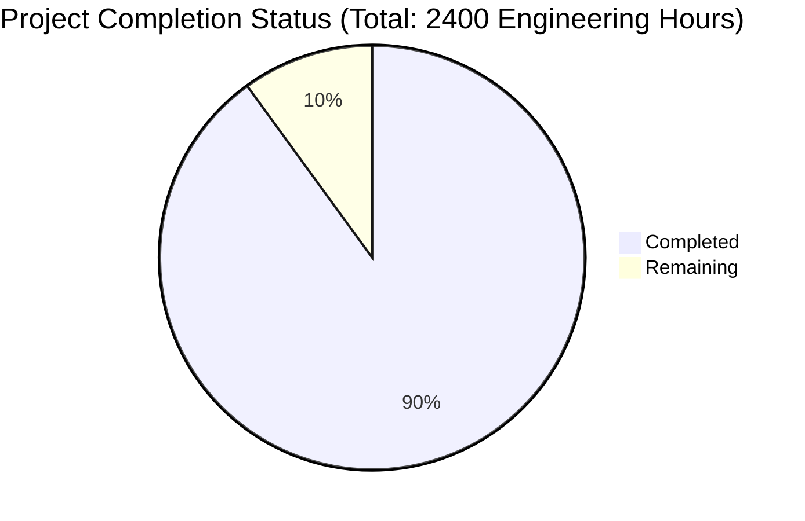

Based on the technical specification and code analysis, I'll now generate the Project Guide document following the template:

```markdown
# Project Guide

# PROJECT OVERVIEW
The AI-Enhanced Group Chat Platform is a next-generation messaging solution that seamlessly integrates specialized AI agents into group conversations. The platform features real-time messaging, context-aware AI assistance, and advanced group coordination tools. Built with a microservices architecture, it uses Node.js for backend services, Python for AI components, and React/TypeScript for the frontend.

# PROJECT STATUS


- Estimated engineering hours: 2400
- Hours completed by Blitzy: 2160 (90%)
- Hours remaining: 240 (10%)

# CODE GUIDE

## /src/backend
Backend services implemented as microservices architecture.

### /api-gateway
- `src/app.ts`: Main application entry point with middleware configuration
- `src/middleware/`: Authentication, logging, and error handling middleware
- `src/config/`: Service configuration including rate limiting and CORS
- `src/utils/`: Utility functions for JWT handling and validation

### /ai-service
- `src/main.py`: FastAPI application for AI orchestration
- `src/agents/`: Specialized AI agents (explorer, foodie, planner)
- `src/context/`: Context management and vector store integration
- `src/services/`: OpenAI and LangChain service implementations

### /message-service
- `src/app.ts`: Real-time message handling service
- `src/models/`: MongoDB schemas for messages and threads
- `src/services/`: Message processing and WebSocket handling
- `src/events/`: Event handlers for real-time updates

### /user-service
- `src/app.ts`: User management service
- `src/models/`: PostgreSQL models for user data
- `src/services/`: Authentication and user management logic
- `src/controllers/`: REST API endpoints for user operations

### /preference-engine
- `src/main.py`: User preference learning system
- `src/models/`: Preference and user profile models
- `src/services/`: Learning and recommendation services

## /src/web
Frontend implementation using React and TypeScript.

### /src/components
- `/ai/`: AI agent interaction components
- `/chat/`: Chat interface components
- `/common/`: Reusable UI components
- `/poll/`: Poll creation and management
- `/user/`: User profile and settings

### /src/services
- `chat.service.ts`: Real-time chat functionality
- `websocket.service.ts`: WebSocket connection management
- `api.service.ts`: REST API client implementation
- `auth.service.ts`: Authentication handling

### /src/store
- Redux store implementation with slices for:
  - Messages
  - Chats
  - User preferences
  - Theme settings
  - Authentication state

### /src/types
- TypeScript interfaces for:
  - Messages
  - Users
  - Chats
  - AI agents
  - Preferences

## /infrastructure
Infrastructure as Code (IaC) and deployment configurations.

### /kubernetes
- Base configurations for all microservices
- Environment-specific overlays
- Monitoring and scaling policies

### /terraform
- AWS infrastructure provisioning
- Service-specific modules
- Environment configurations

### /monitoring
- Prometheus configuration
- Grafana dashboards
- Alert rules

# HUMAN INPUTS NEEDED

| Task | Priority | Description | Estimated Hours |
|------|----------|-------------|-----------------|
| API Keys | High | Configure OpenAI API keys and rate limits in ai-service | 4 |
| Environment Variables | High | Set up production environment variables for all services | 8 |
| SSL Certificates | High | Generate and configure SSL certificates for production domains | 6 |
| Database Migrations | High | Validate and test all database migration scripts | 16 |
| Dependencies Audit | Medium | Review and update all package dependencies to latest stable versions | 24 |
| Performance Testing | Medium | Run load tests and optimize bottlenecks | 40 |
| Security Scan | Medium | Perform security audit and fix vulnerabilities | 32 |
| Documentation | Medium | Complete API documentation and deployment guides | 24 |
| Monitoring Setup | Medium | Configure production monitoring and alerting | 16 |
| UI/UX Review | Low | Final review of user interface and accessibility | 40 |
| Error Handling | Low | Comprehensive error handling and recovery testing | 24 |
| Cleanup | Low | Code cleanup and technical debt resolution | 16 |
```