# Technical Specifications

# 1. INTRODUCTION

## 1.1 EXECUTIVE SUMMARY

The AI-Enhanced Group Chat Platform represents a next-generation messaging solution that seamlessly integrates specialized artificial intelligence agents into group conversations. This system addresses the growing need for more efficient and intelligent group communication by providing contextual AI assistance while maintaining the natural flow of conversation. The platform targets social organizers, casual users, and technology enthusiasts who seek to streamline group decision-making and access specialized knowledge on-demand.

The solution delivers significant value through reduced decision-making time, enhanced group coordination, and personalized assistance across various domains, positioning itself as a unique offering in the messaging platform market.

## 1.2 SYSTEM OVERVIEW

### Project Context

| Aspect | Description |
|--------|-------------|
| Market Position | First-to-market AI-enhanced group messaging platform with specialized agent capabilities |
| Current Limitations | Traditional messaging apps lack intelligent assistance and group decision support |
| Enterprise Integration | Standalone system with potential for future enterprise authentication integration |

### High-Level Description

The system architecture comprises:

- Real-time messaging infrastructure with AI agent integration
- Context-aware natural language processing engine
- Multi-agent coordination system
- User preference learning framework
- Group dynamics analysis engine
- Recommendation management system

Key architectural decisions:

- Microservices-based architecture for scalability
- Event-driven design for real-time interactions
- Cloud-native deployment model
- Vector database for AI context management
- Multi-modal data storage approach

### Success Criteria

| Metric | Target |
|--------|---------|
| User Engagement | 70% monthly active user retention |
| Response Accuracy | 90% AI agent response relevance |
| Decision Time | 50% reduction in group decision-making time |
| User Satisfaction | 4.5/5 average user satisfaction rating |
| System Performance | 99.9% uptime with <2s message delivery |

## 1.3 SCOPE

### In-Scope Elements

Core Features:

| Feature Category | Components |
|-----------------|------------|
| Messaging | Real-time chat, threading, formatting, emoji support |
| AI Integration | @mention triggers, context awareness, proactive assistance |
| Group Tools | Polling, decision tracking, recommendation sharing |
| Learning System | Preference tracking, pattern recognition, personalization |
| User Management | Profiles, authentication, authorization |

Implementation Boundaries:

- User Groups: Consumer users aged 18-45
- Geographic Coverage: Global deployment, English language
- Data Domains: User messages, preferences, AI interactions
- Technical Scope: Web and mobile applications

### Out-of-Scope Elements

- Video/voice calling capabilities
- File storage and sharing system
- End-to-end encryption
- Payment processing
- Third-party app marketplace
- Custom AI model training interface
- Multi-language support (Phase 1)
- Enterprise administration features
- Offline message queuing
- Custom plugin development

# 2. SYSTEM ARCHITECTURE

## 2.1 High-Level Architecture

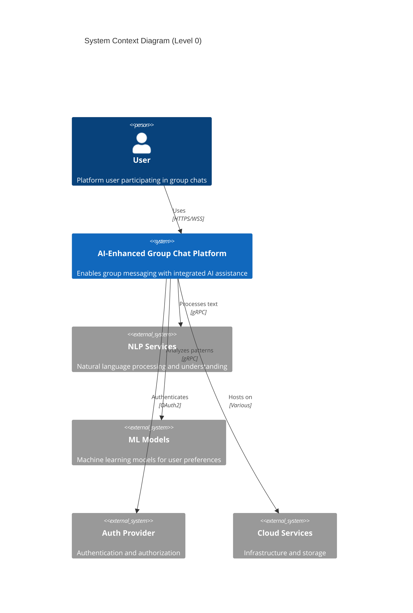
```mermaid
C4Context
    title System Context Diagram (Level 0)
    
    Person(user, "User", "Platform user participating in group chats")
    System(platform, "AI-Enhanced Group Chat Platform", "Enables group messaging with integrated AI assistance")
    
    System_Ext(nlp, "NLP Services", "Natural language processing and understanding")
    System_Ext(ml, "ML Models", "Machine learning models for user preferences")
    System_Ext(auth, "Auth Provider", "Authentication and authorization")
    System_Ext(cloud, "Cloud Services", "Infrastructure and storage")
    
    Rel(user, platform, "Uses", "HTTPS/WSS")
    Rel(platform, nlp, "Processes text", "gRPC")
    Rel(platform, ml, "Analyzes patterns", "gRPC")
    Rel(platform, auth, "Authenticates", "OAuth2")
    Rel(platform, cloud, "Hosts on", "Various")
```

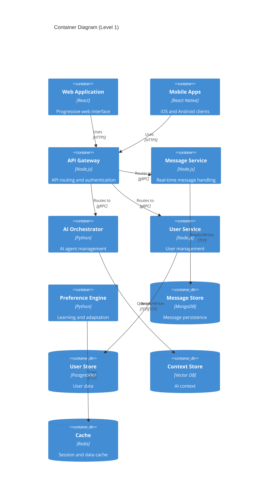
```mermaid
C4Container
    title Container Diagram (Level 1)
    
    Container(web, "Web Application", "React", "Progressive web interface")
    Container(mobile, "Mobile Apps", "React Native", "iOS and Android clients")
    
    Container(api, "API Gateway", "Node.js", "API routing and authentication")
    Container(msg, "Message Service", "Node.js", "Real-time message handling")
    Container(ai, "AI Orchestrator", "Python", "AI agent management")
    Container(user, "User Service", "Node.js", "User management")
    Container(pref, "Preference Engine", "Python", "Learning and adaptation")
    
    ContainerDb(msg_db, "Message Store", "MongoDB", "Message persistence")
    ContainerDb(user_db, "User Store", "PostgreSQL", "User data")
    ContainerDb(vector_db, "Context Store", "Vector DB", "AI context")
    ContainerDb(cache, "Cache", "Redis", "Session and data cache")
    
    Rel(web, api, "Uses", "HTTPS")
    Rel(mobile, api, "Uses", "HTTPS")
    Rel(api, msg, "Routes to", "gRPC")
    Rel(api, ai, "Routes to", "gRPC")
    Rel(api, user, "Routes to", "gRPC")
    Rel(msg, msg_db, "Reads/Writes", "TCP")
    Rel(user, user_db, "Reads/Writes", "TCP")
    Rel(ai, vector_db, "Queries", "TCP")
    Rel(pref, cache, "Uses", "TCP")
```

## 2.2 Component Details

### 2.2.1 Core Components

| Component | Purpose | Technology Stack | Scaling Strategy |
|-----------|---------|-----------------|------------------|
| API Gateway | Request routing, authentication | Node.js, Express | Horizontal with load balancing |
| Message Service | Real-time message handling | Node.js, WebSocket | Horizontal with sticky sessions |
| AI Orchestrator | AI agent management | Python, FastAPI | Vertical with GPU support |
| User Service | User management, profiles | Node.js, TypeScript | Horizontal with sharding |
| Preference Engine | Learning system | Python, TensorFlow | Vertical with batch processing |

### 2.2.2 Data Stores

| Store Type | Technology | Purpose | Scaling Approach |
|------------|------------|---------|------------------|
| Message Store | MongoDB | Message persistence | Sharding by group ID |
| User Store | PostgreSQL | User data | Master-slave replication |
| Context Store | Milvus | Vector embeddings | Cluster with partitioning |
| Cache Layer | Redis | Session, hot data | Redis Cluster |

## 2.3 Technical Decisions

### 2.3.1 Architecture Pattern

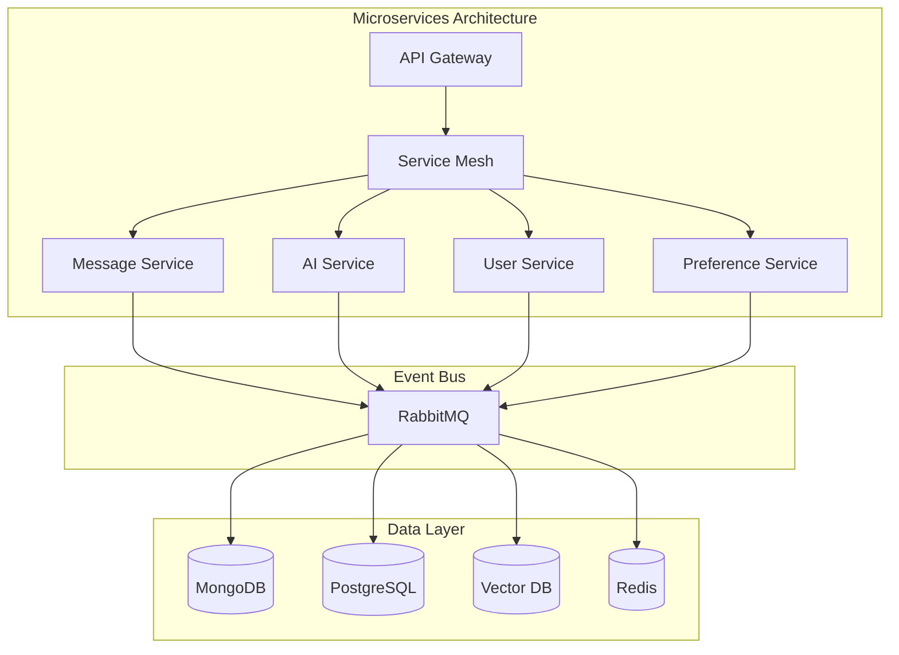
```mermaid
flowchart TD
    subgraph "Microservices Architecture"
        A[API Gateway] --> B[Service Mesh]
        B --> C[Message Service]
        B --> D[AI Service]
        B --> E[User Service]
        B --> F[Preference Service]
    end
    
    subgraph "Event Bus"
        G[RabbitMQ]
    end
    
    subgraph "Data Layer"
        H[(MongoDB)]
        I[(PostgreSQL)]
        J[(Vector DB)]
        K[(Redis)]
    end
    
    C --> G
    D --> G
    E --> G
    F --> G
    
    G --> H
    G --> I
    G --> J
    G --> K
```

### 2.3.2 Communication Patterns

| Pattern | Implementation | Use Case |
|---------|---------------|----------|
| Synchronous | gRPC | Service-to-service calls |
| Asynchronous | RabbitMQ | Event notifications |
| Real-time | WebSocket | Client messaging |
| Pub/Sub | Redis Pub/Sub | Cache invalidation |

## 2.4 Cross-Cutting Concerns

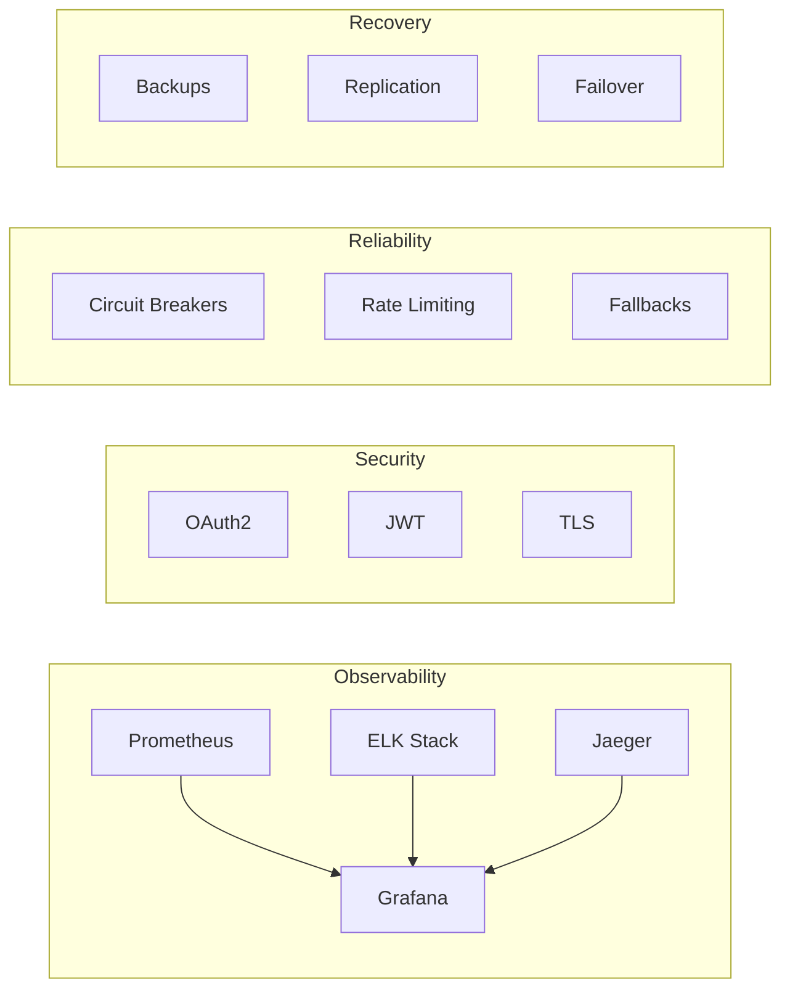
```mermaid
flowchart LR
    subgraph "Observability"
        A[Prometheus] --> B[Grafana]
        C[ELK Stack] --> B
        D[Jaeger] --> B
    end
    
    subgraph "Security"
        E[OAuth2]
        F[JWT]
        G[TLS]
    end
    
    subgraph "Reliability"
        H[Circuit Breakers]
        I[Rate Limiting]
        J[Fallbacks]
    end
    
    subgraph "Recovery"
        K[Backups]
        L[Replication]
        M[Failover]
    end
```

## 2.5 Deployment Architecture

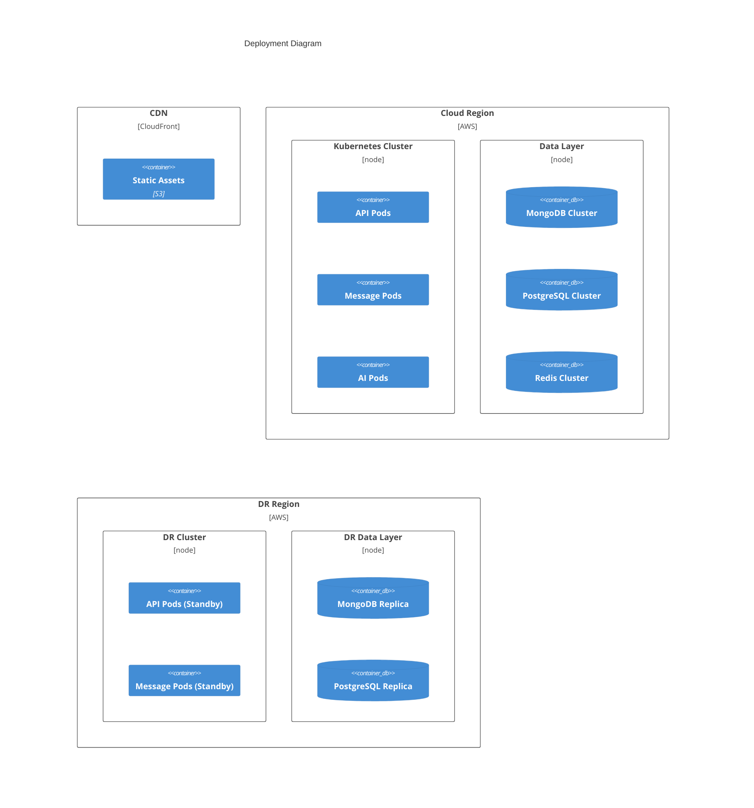
```mermaid
C4Deployment
    title Deployment Diagram
    
    Deployment_Node(cdn, "CDN", "CloudFront"){
        Container(static, "Static Assets", "S3")
    }
    
    Deployment_Node(cloud, "Cloud Region", "AWS"){
        Deployment_Node(k8s, "Kubernetes Cluster"){
            Container(api, "API Pods")
            Container(msg, "Message Pods")
            Container(ai, "AI Pods")
        }
        
        Deployment_Node(data, "Data Layer"){
            ContainerDb(mongo, "MongoDB Cluster")
            ContainerDb(postgres, "PostgreSQL Cluster")
            ContainerDb(redis, "Redis Cluster")
        }
    }
    
    Deployment_Node(dr, "DR Region", "AWS"){
        Deployment_Node(k8s_dr, "DR Cluster"){
            Container(api_dr, "API Pods (Standby)")
            Container(msg_dr, "Message Pods (Standby)")
        }
        
        Deployment_Node(data_dr, "DR Data Layer"){
            ContainerDb(mongo_dr, "MongoDB Replica")
            ContainerDb(postgres_dr, "PostgreSQL Replica")
        }
    }
```

# 3. SYSTEM COMPONENTS ARCHITECTURE

## 3.1 USER INTERFACE DESIGN

### 3.1.1 Design Specifications

| Aspect | Requirement |
|--------|-------------|
| Visual Hierarchy | Material Design 3 principles for depth, motion, and interaction |
| Design System | Custom component library based on Material Design tokens |
| Responsive Design | Mobile-first with breakpoints at 320px, 768px, 1024px, 1440px |
| Accessibility | WCAG 2.1 Level AA compliance |
| Browser Support | Chrome 90+, Firefox 90+, Safari 14+, Edge 90+ |
| Theme Support | System-default, light, and dark modes with smooth transitions |
| i18n Support | LTR languages (Phase 1), RTL support planned for Phase 2 |

### 3.1.2 Interface Elements

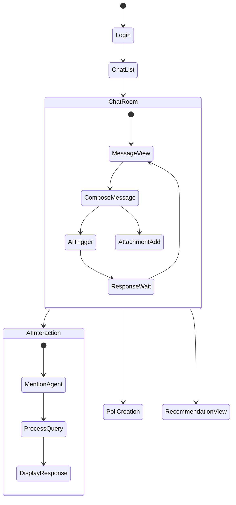
```mermaid
stateDiagram-v2
    [*] --> Login
    Login --> ChatList
    ChatList --> ChatRoom
    ChatRoom --> AIInteraction
    ChatRoom --> PollCreation
    ChatRoom --> RecommendationView
    
    state ChatRoom {
        [*] --> MessageView
        MessageView --> ComposeMessage
        ComposeMessage --> AITrigger
        ComposeMessage --> AttachmentAdd
        AITrigger --> ResponseWait
        ResponseWait --> MessageView
    }
    
    state AIInteraction {
        [*] --> MentionAgent
        MentionAgent --> ProcessQuery
        ProcessQuery --> DisplayResponse
    }
```

### 3.1.3 Critical User Flows

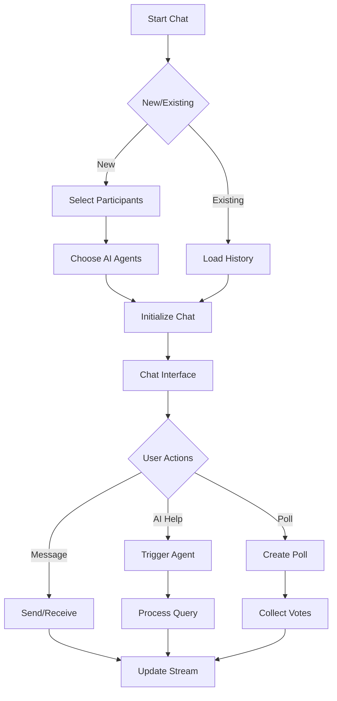
```mermaid
flowchart TD
    A[Start Chat] --> B{New/Existing}
    B -->|New| C[Select Participants]
    B -->|Existing| D[Load History]
    C --> E[Choose AI Agents]
    E --> F[Initialize Chat]
    D --> F
    F --> G[Chat Interface]
    
    G --> H{User Actions}
    H -->|Message| I[Send/Receive]
    H -->|AI Help| J[Trigger Agent]
    H -->|Poll| K[Create Poll]
    
    I --> L[Update Stream]
    J --> M[Process Query]
    K --> N[Collect Votes]
    
    M --> L
    N --> L
```

## 3.2 DATABASE DESIGN

### 3.2.1 Schema Design

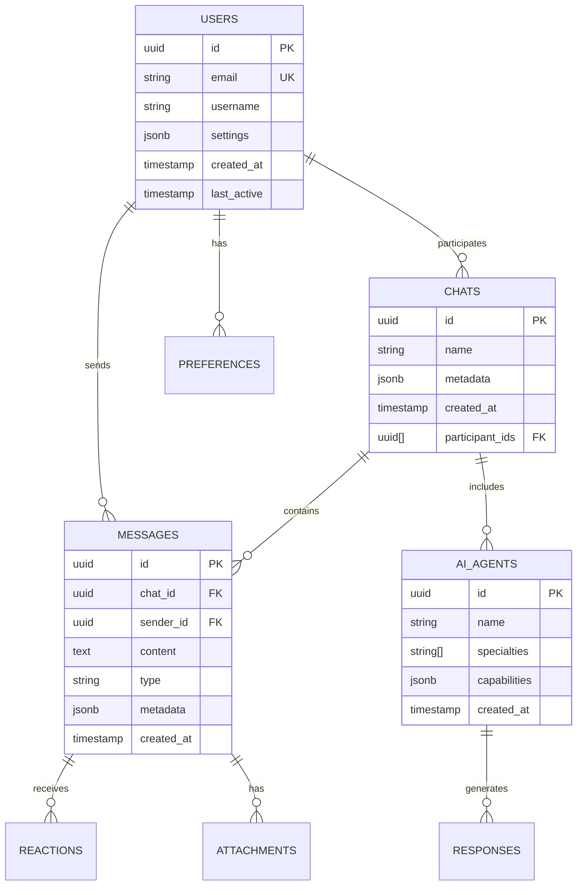
```mermaid
erDiagram
    USERS ||--o{ CHATS : participates
    USERS ||--o{ MESSAGES : sends
    USERS ||--o{ PREFERENCES : has
    CHATS ||--o{ MESSAGES : contains
    CHATS ||--o{ AI_AGENTS : includes
    MESSAGES ||--o{ REACTIONS : receives
    MESSAGES ||--o{ ATTACHMENTS : has
    AI_AGENTS ||--o{ RESPONSES : generates
    
    USERS {
        uuid id PK
        string email UK
        string username
        jsonb settings
        timestamp created_at
        timestamp last_active
    }
    
    CHATS {
        uuid id PK
        string name
        jsonb metadata
        timestamp created_at
        uuid[] participant_ids FK
    }
    
    MESSAGES {
        uuid id PK
        uuid chat_id FK
        uuid sender_id FK
        text content
        string type
        jsonb metadata
        timestamp created_at
    }
    
    AI_AGENTS {
        uuid id PK
        string name
        string[] specialties
        jsonb capabilities
        timestamp created_at
    }
```

### 3.2.2 Data Management Strategy

| Aspect | Implementation |
|--------|---------------|
| Primary Storage | PostgreSQL 14+ for user data and relationships |
| Message Storage | MongoDB for flexible message schema |
| Cache Layer | Redis for session and hot data |
| Vector Storage | Milvus for AI context embeddings |
| Backup Schedule | Hourly incremental, daily full backups |
| Retention Policy | Messages: 12 months, User data: Until deletion |

### 3.2.3 Performance Optimization

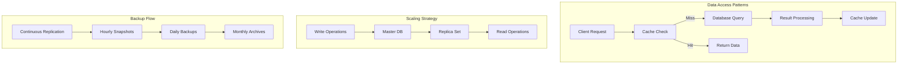
```mermaid
flowchart TD
    subgraph "Data Access Patterns"
        A[Client Request] --> B[Cache Check]
        B -->|Miss| C[Database Query]
        C --> D[Result Processing]
        D --> E[Cache Update]
        B -->|Hit| F[Return Data]
    end
    
    subgraph "Scaling Strategy"
        G[Write Operations] --> H[Master DB]
        H --> I[Replica Set]
        I --> J[Read Operations]
    end
    
    subgraph "Backup Flow"
        K[Continuous Replication] --> L[Hourly Snapshots]
        L --> M[Daily Backups]
        M --> N[Monthly Archives]
    end
```

## 3.3 API DESIGN

### 3.3.1 API Architecture

| Component | Specification |
|-----------|--------------|
| Protocol | REST for client API, gRPC for services |
| Authentication | JWT with OAuth 2.0 |
| Rate Limiting | 100 requests/minute per user |
| Versioning | URI-based (/v1/, /v2/) |
| Documentation | OpenAPI 3.0 specification |
| Security | TLS 1.3, CORS, CSP headers |

### 3.3.2 API Endpoints

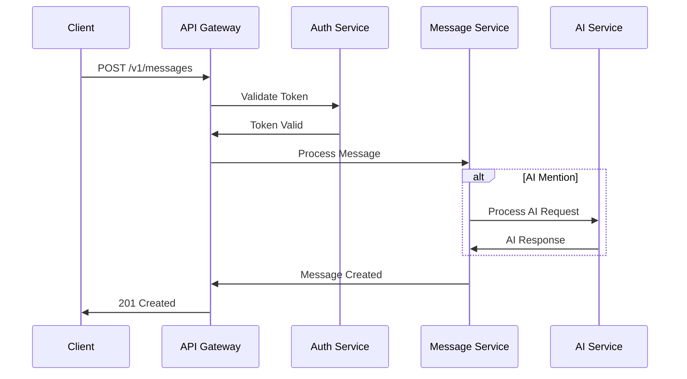
```mermaid
sequenceDiagram
    participant C as Client
    participant G as API Gateway
    participant A as Auth Service
    participant M as Message Service
    participant AI as AI Service
    
    C->>G: POST /v1/messages
    G->>A: Validate Token
    A->>G: Token Valid
    G->>M: Process Message
    
    alt AI Mention
        M->>AI: Process AI Request
        AI->>M: AI Response
    end
    
    M->>G: Message Created
    G->>C: 201 Created
```

### 3.3.3 Integration Patterns

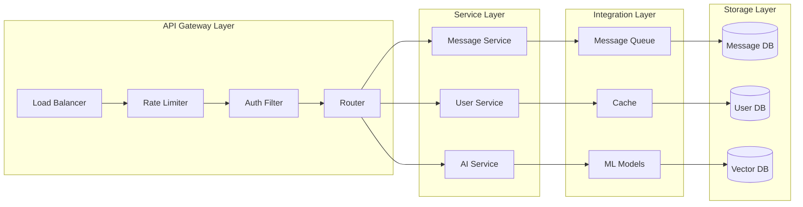
```mermaid
flowchart LR
    subgraph "API Gateway Layer"
        A[Load Balancer] --> B[Rate Limiter]
        B --> C[Auth Filter]
        C --> D[Router]
    end
    
    subgraph "Service Layer"
        D --> E[Message Service]
        D --> F[User Service]
        D --> G[AI Service]
    end
    
    subgraph "Integration Layer"
        E --> H[Message Queue]
        F --> I[Cache]
        G --> J[ML Models]
    end
    
    subgraph "Storage Layer"
        H --> K[(Message DB)]
        I --> L[(User DB)]
        J --> M[(Vector DB)]
    end
```

# 4. TECHNOLOGY STACK

## 4.1 PROGRAMMING LANGUAGES

| Platform/Component | Language | Version | Justification |
|-------------------|----------|---------|---------------|
| Backend Services | Node.js | 18 LTS | Event-driven architecture support, extensive ecosystem for real-time applications |
| AI Services | Python | 3.11+ | Rich ML/AI libraries, optimal for NLP processing |
| Web Frontend | TypeScript | 5.0+ | Type safety, enhanced developer experience, better maintainability |
| Mobile Apps | React Native (TypeScript) | 0.72+ | Code sharing between platforms, consistent user experience |
| Database Scripts | Python | 3.11+ | Strong data processing capabilities, ORM support |
| DevOps Tools | Go | 1.21+ | Efficient resource utilization, strong concurrency support |

## 4.2 FRAMEWORKS & LIBRARIES

### Backend Frameworks

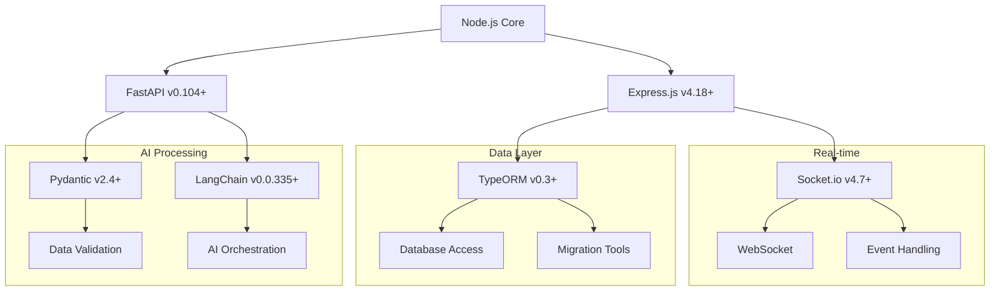
```mermaid
flowchart TD
    A[Node.js Core] --> B[Express.js v4.18+]
    A --> C[FastAPI v0.104+]
    
    B --> D[Socket.io v4.7+]
    B --> E[TypeORM v0.3+]
    
    C --> F[Pydantic v2.4+]
    C --> G[LangChain v0.0.335+]
    
    subgraph Real-time
        D --> H[WebSocket]
        D --> I[Event Handling]
    end
    
    subgraph Data Layer
        E --> J[Database Access]
        E --> K[Migration Tools]
    end
    
    subgraph AI Processing
        F --> L[Data Validation]
        G --> M[AI Orchestration]
    end
```

### Frontend Frameworks

| Framework | Version | Purpose | Justification |
|-----------|---------|---------|---------------|
| React | 18.2+ | Web UI | Component reusability, virtual DOM performance |
| React Native | 0.72+ | Mobile Apps | Cross-platform development efficiency |
| Material UI | 5.14+ | UI Components | Consistent design system, accessibility |
| Redux Toolkit | 1.9+ | State Management | Predictable state updates, dev tools |
| React Query | 4.0+ | Data Fetching | Efficient cache management, real-time updates |

## 4.3 DATABASES & STORAGE

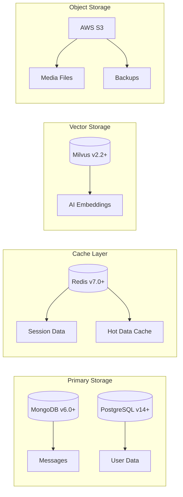
```mermaid
flowchart LR
    subgraph Primary Storage
        A[(MongoDB v6.0+)] --> B[Messages]
        C[(PostgreSQL v14+)] --> D[User Data]
    end
    
    subgraph Cache Layer
        E[(Redis v7.0+)] --> F[Session Data]
        E --> G[Hot Data Cache]
    end
    
    subgraph Vector Storage
        H[(Milvus v2.2+)] --> I[AI Embeddings]
    end
    
    subgraph Object Storage
        J[AWS S3] --> K[Media Files]
        J --> L[Backups]
    end
```

## 4.4 THIRD-PARTY SERVICES

| Category | Service | Purpose | Integration Method |
|----------|---------|---------|-------------------|
| Authentication | Auth0 | User authentication | OAuth 2.0/OIDC |
| AI Processing | OpenAI API | NLP capabilities | REST API |
| Monitoring | Datadog | System monitoring | Agent-based |
| Analytics | Mixpanel | User analytics | SDK |
| Cloud Platform | AWS | Infrastructure | SDK/API |
| CDN | CloudFront | Content delivery | DNS/API |
| Email | SendGrid | Notifications | SMTP/API |

## 4.5 DEVELOPMENT & DEPLOYMENT

### Development Environment

| Tool | Version | Purpose |
|------|---------|---------|
| VS Code | Latest | Primary IDE |
| Docker Desktop | Latest | Local containerization |
| Postman | Latest | API testing |
| Git | 2.40+ | Version control |
| pnpm | 8.0+ | Package management |

### Deployment Pipeline

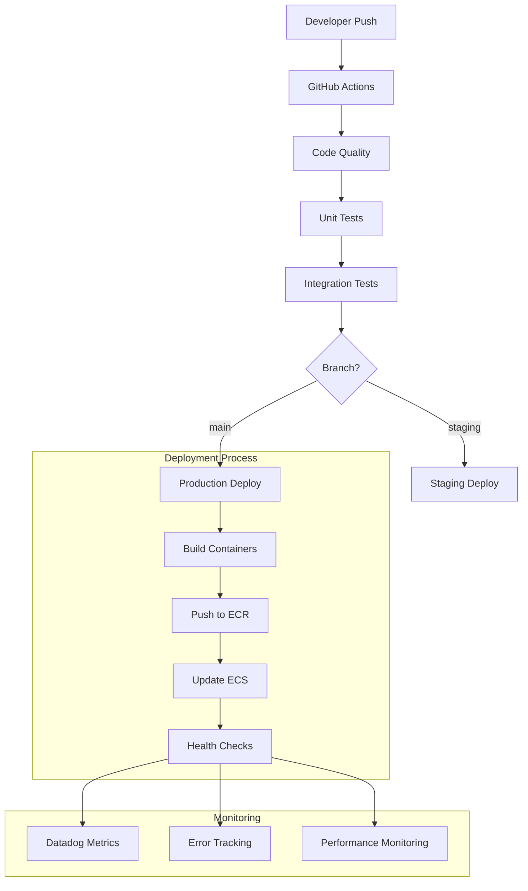
```mermaid
flowchart TD
    A[Developer Push] --> B[GitHub Actions]
    
    B --> C[Code Quality]
    C --> D[Unit Tests]
    D --> E[Integration Tests]
    
    E --> F{Branch?}
    F -->|main| G[Production Deploy]
    F -->|staging| H[Staging Deploy]
    
    subgraph Deployment Process
        G --> I[Build Containers]
        I --> J[Push to ECR]
        J --> K[Update ECS]
        K --> L[Health Checks]
    end
    
    subgraph Monitoring
        L --> M[Datadog Metrics]
        L --> N[Error Tracking]
        L --> O[Performance Monitoring]
    end
```

### Infrastructure Requirements

| Component | Specification | Scaling Strategy |
|-----------|--------------|------------------|
| ECS Clusters | t3.large | Horizontal auto-scaling |
| RDS Instances | db.r6g.xlarge | Vertical with read replicas |
| ElastiCache | cache.r6g.large | Cluster mode enabled |
| Load Balancers | Application LB | Cross-zone enabled |
| S3 Storage | Standard tier | Lifecycle policies |

# 5. SYSTEM DESIGN

## 5.1 USER INTERFACE DESIGN

### 5.1.1 Layout Structure

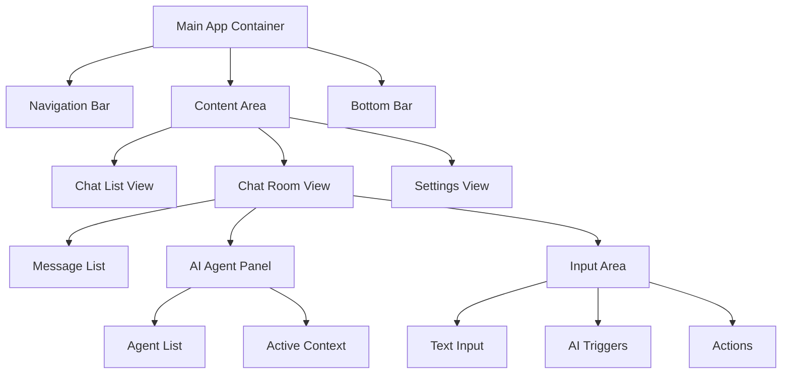
```mermaid
flowchart TD
    A[Main App Container] --> B[Navigation Bar]
    A --> C[Content Area]
    A --> D[Bottom Bar]
    
    C --> E[Chat List View]
    C --> F[Chat Room View]
    C --> G[Settings View]
    
    F --> H[Message List]
    F --> I[AI Agent Panel]
    F --> J[Input Area]
    
    I --> K[Agent List]
    I --> L[Active Context]
    
    J --> M[Text Input]
    J --> N[AI Triggers]
    J --> O[Actions]
```

### 5.1.2 Component Specifications

| Component | Description | Interactions |
|-----------|-------------|--------------|
| Navigation Bar | Fixed top bar with app logo, search, profile | Click, search input |
| Chat List | Scrollable list of active conversations | Tap to select, swipe actions |
| Chat Room | Main messaging interface with AI integration | Scroll, tap, long press |
| AI Agent Panel | Collapsible sidebar showing available agents | Expand/collapse, agent selection |
| Message Input | Rich text area with AI mention support | Text input, @ mentions |

### 5.1.3 Interaction Flows

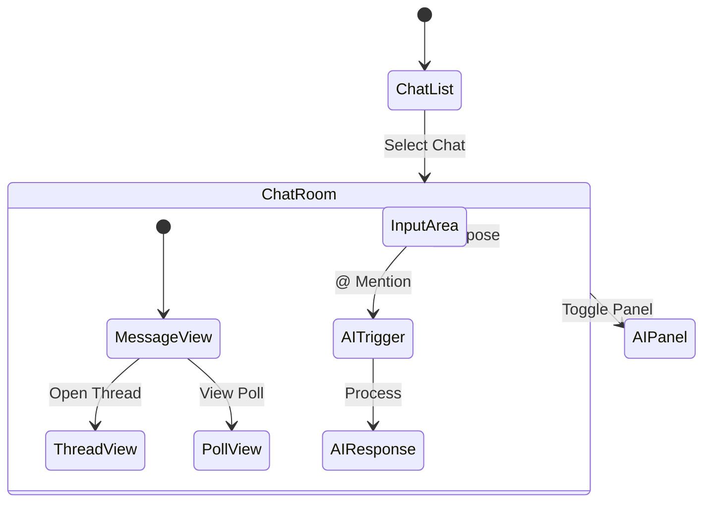
```mermaid
stateDiagram-v2
    [*] --> ChatList
    ChatList --> ChatRoom: Select Chat
    ChatRoom --> AIPanel: Toggle Panel
    ChatRoom --> InputArea: Compose
    
    state ChatRoom {
        [*] --> MessageView
        MessageView --> ThreadView: Open Thread
        MessageView --> PollView: View Poll
        InputArea --> AITrigger: @ Mention
        AITrigger --> AIResponse: Process
    }
```

## 5.2 DATABASE DESIGN

### 5.2.1 Data Models

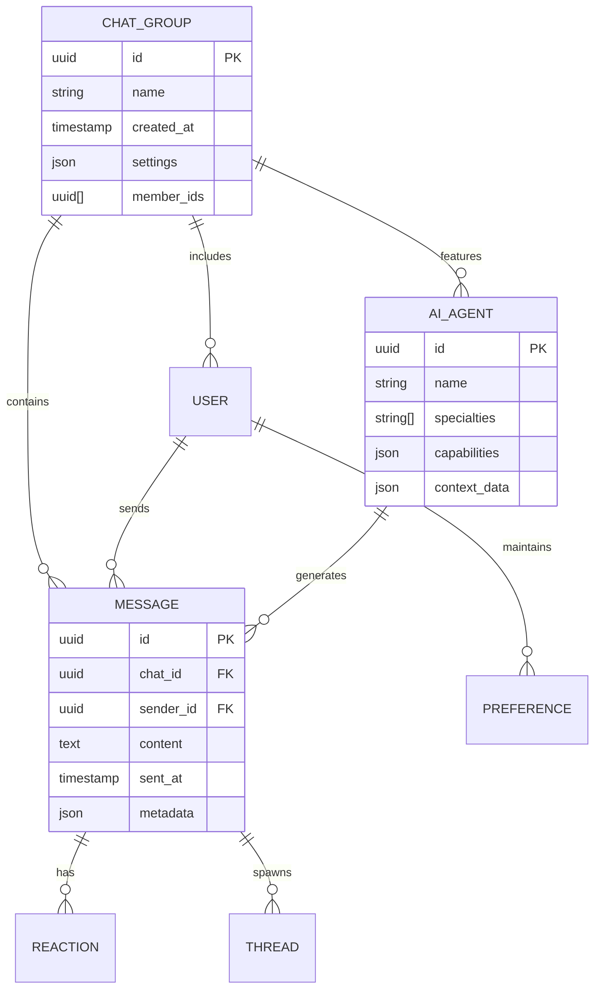
```mermaid
erDiagram
    CHAT_GROUP ||--o{ MESSAGE : contains
    CHAT_GROUP ||--o{ USER : includes
    CHAT_GROUP ||--o{ AI_AGENT : features
    MESSAGE ||--o{ REACTION : has
    MESSAGE ||--o{ THREAD : spawns
    USER ||--o{ MESSAGE : sends
    AI_AGENT ||--o{ MESSAGE : generates
    USER ||--o{ PREFERENCE : maintains
    
    CHAT_GROUP {
        uuid id PK
        string name
        timestamp created_at
        json settings
        uuid[] member_ids
    }
    
    MESSAGE {
        uuid id PK
        uuid chat_id FK
        uuid sender_id FK
        text content
        timestamp sent_at
        json metadata
    }
    
    AI_AGENT {
        uuid id PK
        string name
        string[] specialties
        json capabilities
        json context_data
    }
```

### 5.2.2 Storage Strategy

| Data Type | Storage Solution | Scaling Approach |
|-----------|-----------------|------------------|
| Messages | MongoDB | Horizontal sharding |
| User Data | PostgreSQL | Read replicas |
| Real-time State | Redis | Cluster mode |
| AI Context | Milvus | Distributed deployment |
| Media | S3 | CDN distribution |

## 5.3 API DESIGN

### 5.3.1 API Architecture

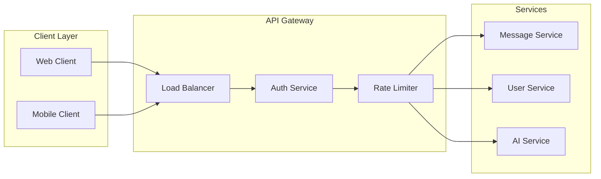
```mermaid
flowchart LR
    subgraph Client Layer
        A[Web Client]
        B[Mobile Client]
    end
    
    subgraph API Gateway
        C[Load Balancer]
        D[Auth Service]
        E[Rate Limiter]
    end
    
    subgraph Services
        F[Message Service]
        G[User Service]
        H[AI Service]
    end
    
    A --> C
    B --> C
    C --> D
    D --> E
    E --> F
    E --> G
    E --> H
```

### 5.3.2 Endpoint Specifications

| Endpoint | Method | Purpose | Authentication |
|----------|---------|---------|----------------|
| /api/v1/messages | POST | Send message | Required |
| /api/v1/chats | GET | List chats | Required |
| /api/v1/agents | GET | List AI agents | Required |
| /api/v1/polls | POST | Create poll | Required |
| /ws/chat | WebSocket | Real-time updates | Required |

### 5.3.3 Data Flow

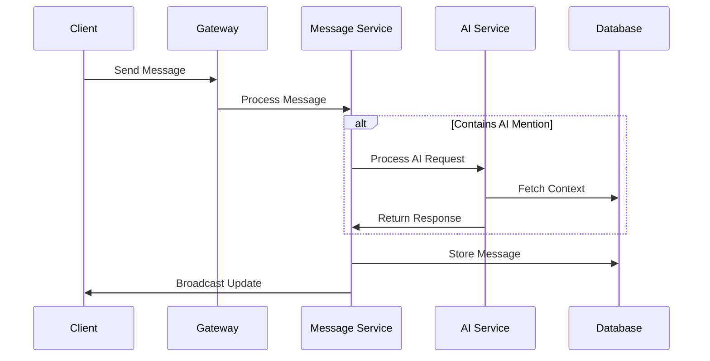
```mermaid
sequenceDiagram
    participant C as Client
    participant G as Gateway
    participant M as Message Service
    participant AI as AI Service
    participant DB as Database
    
    C->>G: Send Message
    G->>M: Process Message
    
    alt Contains AI Mention
        M->>AI: Process AI Request
        AI->>DB: Fetch Context
        AI->>M: Return Response
    end
    
    M->>DB: Store Message
    M->>C: Broadcast Update
```

# 6. USER INTERFACE DESIGN

## 6.1 Common Elements

### 6.1.1 Navigation Bar
```
+----------------------------------------------------------+
| [@] Username    [#] Groups    [?] Help    [=] Settings    |
+----------------------------------------------------------+
```

### 6.1.2 Component Key
```
Icons:
[?] - Help/Documentation
[$] - Payment/Financial
[i] - Information
[+] - Add New/Create
[x] - Close/Delete
[<] [>] - Navigation
[^] - Upload
[#] - Menu/Groups
[@] - User Profile
[!] - Alert/Warning
[=] - Settings
[*] - Favorite/Important

Interactive Elements:
[ ] - Checkbox
( ) - Radio Button
[Button] - Clickable Button
[...] - Text Input Field
[====] - Progress Bar
[v] - Dropdown Menu
```

## 6.2 Main Chat Interface

```
+----------------------------------------------------------+
| [@] JohnDoe    [#] Groups    [?] Help    [=] Settings    |
+----------------------------------------------------------+
|                                                          |
|  +------------------+  +-------------------------------+ |
|  | ACTIVE CHATS     |  | Paris Trip Planning          | |
|  |                  |  | ----------------------------- | |
|  | [*] Paris Trip   |  | @Alice: Where should we eat? | |
|  | [ ] NYC Meetup   |  |                             | |
|  | [ ] Book Club    |  | @foodie: Based on your      | |
|  |                  |  | location near the Louvre,    | |
|  | [+] New Chat     |  | I recommend Bistrot Vivienne | |
|  |                  |  |                             | |
|  |                  |  | [Create Poll] [Add Agent]    | |
|  +------------------+  |                             | |
|                       | [...........................] | |
|                       | [Send] [@Agent] [^] [=]       | |
|                       +-------------------------------+ |
+----------------------------------------------------------+
```

## 6.3 AI Agent Panel

```
+----------------------------------------+
| AVAILABLE AI AGENTS                    |
|----------------------------------------|
| [@foodie]                             |
| Specialty: Restaurant & Dining         |
| Status: Active                         |
|----------------------------------------|
| [@explorer]                           |
| Specialty: Attractions & Activities    |
| Status: Active                         |
|----------------------------------------|
| [@planner]                            |
| Specialty: Itinerary Organization      |
| Status: Available                      |
|----------------------------------------|
| [+] Add New Agent                      |
+----------------------------------------+
```

## 6.4 Poll Creation Interface

```
+----------------------------------------+
| CREATE POLL                            |
|----------------------------------------|
| Question:                              |
| [...................................] |
|                                        |
| Options:                               |
| [+] Option 1 [.....................]   |
| [+] Option 2 [.....................]   |
| [+] Option 3 [.....................]   |
|                                        |
| Settings:                              |
| [ ] Allow multiple choices             |
| [ ] Set deadline                       |
| [v] Visibility: All Members            |
|                                        |
| [Create Poll]        [Cancel]          |
+----------------------------------------+
```

## 6.5 Recommendation View

```
+----------------------------------------+
| SAVED RECOMMENDATIONS                  |
|----------------------------------------+
| [*] Bistrot Vivienne                   |
| Recommended by: @foodie                |
| Category: Dining                       |
| Rating: 4.5/5                          |
| [View Details] [Share] [x]             |
|----------------------------------------|
| [ ] Louvre Guided Tour                 |
| Recommended by: @explorer              |
| Category: Activity                     |
| Rating: 4.8/5                          |
| [View Details] [Share] [x]             |
|----------------------------------------|
| [Filter v]    [Sort v]    [Export]     |
+----------------------------------------+
```

## 6.6 Mobile Responsive Layout

```
+--------------------+
| [@] [#] [?] [=]   |
|--------------------|
| PARIS TRIP        |
|--------------------|
| @Alice: Where...  |
|                   |
| @foodie: Based... |
|                   |
| [Show Agents v]   |
|                   |
|--------------------|
| [...............] |
| [@] [^] [Send]    |
+--------------------+
```

## 6.7 Interaction States

### 6.7.1 Message States
```
[====]     - Sending
[====✓]    - Delivered
[====✓✓]   - Read
[!]        - Failed to Send
```

### 6.7.2 AI Agent States
```
[@agent●]  - Active/Responding
[@agent○]  - Available
[@agent-]  - Unavailable
[@agent!]  - Error State
```

## 6.8 Accessibility Features

- High contrast mode support
- Screen reader compatibility
- Keyboard navigation shortcuts
- Customizable font sizes
- Focus indicators
- Alternative text for icons
- ARIA labels for interactive elements

## 6.9 Theme Support

```
+------------------+
| THEME SETTINGS   |
|------------------|
| Mode:           |
| ( ) Light       |
| ( ) Dark        |
| ( ) System      |
|------------------|
| Accent Color:   |
| [v] Blue        |
|------------------|
| Font Size:      |
| [v] Medium      |
|------------------|
| [Apply] [Reset] |
+------------------+
```

# 7. SECURITY CONSIDERATIONS

## 7.1 AUTHENTICATION AND AUTHORIZATION

### 7.1.1 Authentication Flow

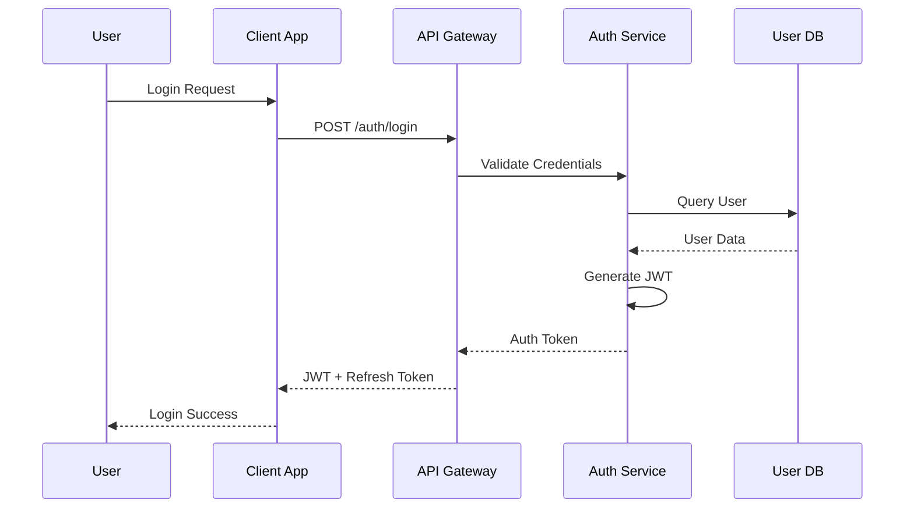
```mermaid
sequenceDiagram
    participant U as User
    participant C as Client App
    participant G as API Gateway
    participant A as Auth Service
    participant D as User DB
    
    U->>C: Login Request
    C->>G: POST /auth/login
    G->>A: Validate Credentials
    A->>D: Query User
    D-->>A: User Data
    A->>A: Generate JWT
    A-->>G: Auth Token
    G-->>C: JWT + Refresh Token
    C-->>U: Login Success
```

### 7.1.2 Authorization Matrix

| Role | Chat Access | AI Agent Access | Admin Functions | User Management |
|------|-------------|-----------------|-----------------|-----------------|
| User | Own chats only | Basic agents | None | Self only |
| Premium User | All public chats | All agents | None | Self only |
| Moderator | All chats | All agents | Content moderation | None |
| Admin | All chats | All agents | Full access | Full access |

### 7.1.3 Token Management

| Token Type | Lifetime | Refresh Policy | Storage Location |
|------------|----------|----------------|------------------|
| Access JWT | 1 hour | Required after expiry | Client memory |
| Refresh Token | 7 days | Rolling refresh | HTTP-only cookie |
| API Key | 90 days | Manual renewal | Secure storage |

## 7.2 DATA SECURITY

### 7.2.1 Encryption Standards

```mermaid
flowchart TD
    A[Data Categories] --> B[Data in Transit]
    A --> C[Data at Rest]
    A --> D[Data in Use]
    
    B --> E[TLS 1.3]
    B --> F[Perfect Forward Secrecy]
    
    C --> G[AES-256 GCM]
    C --> H[Key Rotation]
    
    D --> I[Memory Encryption]
    D --> J[Secure Enclaves]
    
    subgraph Key Management
        K[HSM Integration]
        L[Key Rotation Policy]
        M[Access Controls]
    end
```

### 7.2.2 Data Classification

| Data Type | Classification | Protection Level | Encryption | Access Control |
|-----------|---------------|------------------|------------|----------------|
| User Credentials | Critical | Highest | AES-256 + Salt | MFA Required |
| Chat Messages | Sensitive | High | TLS + AES-256 | Role-Based |
| AI Context Data | Confidential | Medium | AES-256 | Service-Level |
| Analytics Data | Internal | Standard | AES-256 | Role-Based |
| Public Content | Public | Basic | TLS Only | None |

## 7.3 SECURITY PROTOCOLS

### 7.3.1 Security Controls

```mermaid
flowchart LR
    subgraph Prevention
        A[WAF] --> B[DDoS Protection]
        B --> C[Input Validation]
        C --> D[Rate Limiting]
    end
    
    subgraph Detection
        E[IDS/IPS] --> F[Log Monitoring]
        F --> G[Threat Analytics]
        G --> H[Anomaly Detection]
    end
    
    subgraph Response
        I[Incident Response] --> J[Auto-blocking]
        J --> K[Alert System]
        K --> L[Recovery Plan]
    end
```

### 7.3.2 Security Monitoring

| Component | Monitoring Type | Alert Threshold | Response Time |
|-----------|----------------|-----------------|---------------|
| API Gateway | Rate/Pattern | >1000 req/min | Immediate |
| Auth Service | Failed Attempts | >5 fails/min | 30 seconds |
| Database | Access Patterns | Unusual activity | 1 minute |
| AI Services | Usage Patterns | Abnormal requests | 2 minutes |

### 7.3.3 Compliance Requirements

| Standard | Requirement | Implementation |
|----------|-------------|----------------|
| GDPR | Data Protection | Encryption + Access Controls |
| SOC 2 | Security Controls | Continuous Monitoring |
| CCPA | Privacy Rights | User Data Portal |
| HIPAA | Data Handling | Secure Storage + Audit |

### 7.3.4 Security Update Process

```mermaid
flowchart TD
    A[Security Update] --> B{Severity Level}
    B -->|Critical| C[Immediate Deploy]
    B -->|High| D[24hr Window]
    B -->|Medium| E[Next Sprint]
    B -->|Low| F[Scheduled Update]
    
    C --> G[Validation]
    D --> G
    E --> G
    F --> G
    
    G --> H[Deployment]
    H --> I[Monitoring]
    I --> J[Documentation]
```

### 7.3.5 Incident Response Plan

| Phase | Actions | Responsible Team | SLA |
|-------|---------|-----------------|-----|
| Detection | Log Analysis, Alert Verification | Security Ops | 5 minutes |
| Containment | Service Isolation, Traffic Block | DevOps | 15 minutes |
| Eradication | Patch Deploy, System Hardening | Development | 1 hour |
| Recovery | Service Restoration, Data Validation | Operations | 2 hours |
| Review | Incident Analysis, Process Update | Security Team | 24 hours |

# 8. INFRASTRUCTURE

## 8.1 DEPLOYMENT ENVIRONMENT

The AI-Enhanced Group Chat Platform utilizes a cloud-native deployment model with multi-region support.

```mermaid
flowchart TD
    subgraph Production Environment
        A[Primary Region] --> B[DR Region]
        
        subgraph Primary Region
            C[Load Balancer] --> D[Application Cluster]
            D --> E[Data Layer]
            D --> F[AI Processing]
        end
        
        subgraph DR Region
            G[Standby Load Balancer] --> H[Standby Cluster]
            H --> I[Replicated Data]
        end
    end
    
    subgraph Support Environments
        J[Development]
        K[Staging]
        L[QA]
    end
```

| Environment | Purpose | Scale | Region |
|-------------|---------|--------|---------|
| Production | Live system | Full scale | Multi-region |
| Staging | Pre-production testing | 25% of prod | Single region |
| QA | Testing and validation | Minimal | Single region |
| Development | Development work | Minimal | Single region |

## 8.2 CLOUD SERVICES

Primary cloud provider: AWS

| Service | Purpose | Justification |
|---------|---------|---------------|
| EKS | Container orchestration | Managed Kubernetes with high availability |
| RDS | PostgreSQL databases | Managed database with automatic failover |
| DocumentDB | MongoDB workloads | Compatible API with managed scaling |
| ElastiCache | Redis caching | In-memory performance for real-time data |
| S3 | Object storage | Scalable storage for media and backups |
| CloudFront | CDN | Global content delivery |
| Route53 | DNS management | Global DNS with health checking |
| SQS/SNS | Message queuing | Reliable async communication |

## 8.3 CONTAINERIZATION

```mermaid
flowchart LR
    subgraph Container Architecture
        A[Base Images] --> B[Service Images]
        B --> C[Runtime Containers]
        
        subgraph Base Images
            D[Node.js]
            E[Python]
            F[Redis]
        end
        
        subgraph Service Images
            G[API Service]
            H[Message Service]
            I[AI Service]
        end
    end
```

| Component | Base Image | Size Limit | Build Time |
|-----------|------------|------------|------------|
| API Service | node:18-alpine | 250MB | <5 mins |
| Message Service | node:18-alpine | 250MB | <5 mins |
| AI Service | python:3.11-slim | 1GB | <10 mins |
| Cache | redis:7-alpine | 100MB | <2 mins |

## 8.4 ORCHESTRATION

Kubernetes configuration:

```mermaid
flowchart TD
    subgraph Kubernetes Cluster
        A[Ingress Controller] --> B[Service Mesh]
        
        B --> C[API Pods]
        B --> D[Message Pods]
        B --> E[AI Pods]
        
        subgraph Storage
            F[(Persistent Volumes)]
        end
        
        subgraph Networking
            G[Internal DNS]
            H[Load Balancing]
        end
    end
```

| Resource | Specification | Scaling Policy |
|----------|---------------|----------------|
| API Pods | 2-10 replicas | CPU > 70% |
| Message Pods | 3-15 replicas | Memory > 80% |
| AI Pods | 2-8 replicas | GPU > 60% |
| Cache Pods | 3 replicas | Fixed |

## 8.5 CI/CD PIPELINE

```mermaid
flowchart LR
    A[Code Push] --> B[GitHub Actions]
    B --> C[Build]
    C --> D[Test]
    D --> E[Security Scan]
    E --> F{Branch?}
    F -->|main| G[Production Deploy]
    F -->|staging| H[Staging Deploy]
    
    subgraph Deployment Process
        G --> I[Canary Release]
        I --> J[Full Release]
        H --> K[Integration Tests]
    end
    
    subgraph Monitoring
        J --> L[Health Checks]
        L --> M[Metrics Collection]
    end
```

| Stage | Tools | SLA | Automation |
|-------|-------|-----|------------|
| Build | GitHub Actions | <5 mins | Full |
| Test | Jest, Pytest | <10 mins | Full |
| Security | Snyk, SonarQube | <15 mins | Full |
| Deploy | ArgoCD | <30 mins | Semi |
| Verify | Datadog | <5 mins | Full |

Deployment Strategy:
- Blue-green deployments for zero-downtime updates
- Canary releases for risk mitigation
- Automated rollback capabilities
- Feature flags for controlled rollouts
- Automated environment promotion

# APPENDICES

## A.1 ADDITIONAL TECHNICAL INFORMATION

### A.1.1 AI Agent Specialization Matrix

| Agent Type | Primary Expertise | Secondary Capabilities | Integration Points |
|------------|------------------|----------------------|-------------------|
| @explorer | Travel & Activities | Local Events, Transportation | Maps API, Event APIs |
| @foodie | Restaurants & Dining | Dietary Preferences, Cuisine Types | Restaurant APIs, Review Platforms |
| @planner | Itinerary Organization | Time Management, Group Coordination | Calendar API, Weather API |
| @budget | Financial Planning | Cost Comparison, Deals | Payment APIs, Price Tracking |
| @local | Local Knowledge | Cultural Insights, Safety Tips | Location Services, News APIs |

### A.1.2 Message Processing Pipeline

```mermaid
flowchart TD
    A[Message Input] --> B{Contains @mention?}
    B -->|Yes| C[AI Processing Queue]
    B -->|No| D[Standard Message Queue]
    
    C --> E[Context Extraction]
    E --> F[Agent Selection]
    F --> G[Response Generation]
    G --> H[Message Enrichment]
    
    D --> H
    H --> I[Message Storage]
    I --> J[Real-time Distribution]
    
    subgraph "AI Context Management"
        K[Short-term Memory]
        L[Long-term Memory]
        M[Group Context]
    end
    
    E --> K
    K --> L
    L --> G
    M --> G
```

## A.2 GLOSSARY

| Term | Definition |
|------|------------|
| Agent Specialization | The specific domain expertise and capabilities assigned to an AI agent |
| Context Extraction | Process of analyzing message content and metadata to understand conversation context |
| Group Dynamics Analysis | Automated assessment of interaction patterns between group members |
| Message Enrichment | Process of adding metadata, context, and AI-generated content to messages |
| Preference Learning | System's capability to adapt to user preferences over time |
| Proactive Suggestion | AI-initiated recommendations without explicit user prompting |
| Real-time Distribution | Immediate delivery of messages to all group participants |
| Vector Embedding | Numerical representation of text data for AI processing |

## A.3 ACRONYMS

| Acronym | Full Form |
|---------|-----------|
| API | Application Programming Interface |
| CDN | Content Delivery Network |
| DNS | Domain Name System |
| ECS | Elastic Container Service |
| EKS | Elastic Kubernetes Service |
| gRPC | Google Remote Procedure Call |
| HSM | Hardware Security Module |
| IDS | Intrusion Detection System |
| IPS | Intrusion Prevention System |
| JWT | JSON Web Token |
| ML | Machine Learning |
| NLP | Natural Language Processing |
| OIDC | OpenID Connect |
| RDS | Relational Database Service |
| SDK | Software Development Kit |
| SLA | Service Level Agreement |
| SSL | Secure Sockets Layer |
| TLS | Transport Layer Security |
| WAF | Web Application Firewall |
| WSS | WebSocket Secure |

## A.4 SYSTEM METRICS

```mermaid
flowchart LR
    subgraph Performance Metrics
        A[Response Time] --> B[<2s Message Delivery]
        A --> C[<5s AI Response]
        A --> D[<100ms DB Query]
    end
    
    subgraph Reliability Metrics
        E[Uptime] --> F[99.9% Availability]
        E --> G[<10min Recovery]
        E --> H[<1min Data Loss]
    end
    
    subgraph Scale Metrics
        I[Capacity] --> J[5000 CCU/Server]
        I --> K[1000 Msgs/Sec]
        I --> L[500GB Data/Year]
    end
```

## A.5 COMPLIANCE MATRIX

| Requirement | Standard | Implementation | Validation |
|-------------|----------|----------------|------------|
| Data Privacy | GDPR | Data encryption, user consent | Annual audit |
| Accessibility | WCAG 2.1 | Screen reader support, keyboard navigation | Automated testing |
| Security | SOC 2 | Access controls, audit logging | External audit |
| Performance | SLA | Load balancing, caching | Continuous monitoring |
| Reliability | ISO 27001 | Redundancy, failover | Disaster recovery testing |